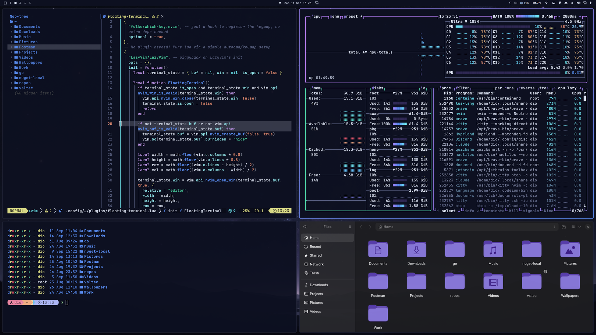

# Celestial

A cold, high-contrast dark theme for [Omarchy](https://omarchy.org/).

Deep blue-black ground with a lavender accent, mint green and ice cyan. The
palette keeps `accent` separate from `blue`, so selections and borders read as
purple while syntax keeps its own blue.



## Install

```bash
omarchy theme install https://github.com/dioannou30/omarchy-celestial-theme
```

Then apply it:

```bash
omarchy theme set celestial
```

## Palette

```toml
mode = "dark"

background = "#0d1020"
foreground = "#dde4f5"
accent     = "#8b75d9"

red     = "#e8566b"
orange  = "#e08b72"
yellow  = "#dfe08a"
green   = "#4fd6a8"
cyan    = "#6fe9f5"
blue    = "#5a8df2"
magenta = "#b57df5"
brown   = "#9c8477"
```

Foreground sits at 14.8:1 against the background, toward the higher-contrast
end of Omarchy's dark themes without reaching the glare of a pure white.

## Backgrounds

`celestial-void.png` ships with the theme: a wide night sky over a mountain
horizon, matched to the palette.

To use your own instead, drop images into
`~/.config/omarchy/backgrounds/celestial/` and cycle with
`omarchy theme bg next`.

## Customizing

Colors live in `colors.toml`. Omarchy generates every application's theme file
from it, so editing that one file restyles the terminal, editor, bar, and the
rest together. After an edit, run `omarchy theme refresh`.
